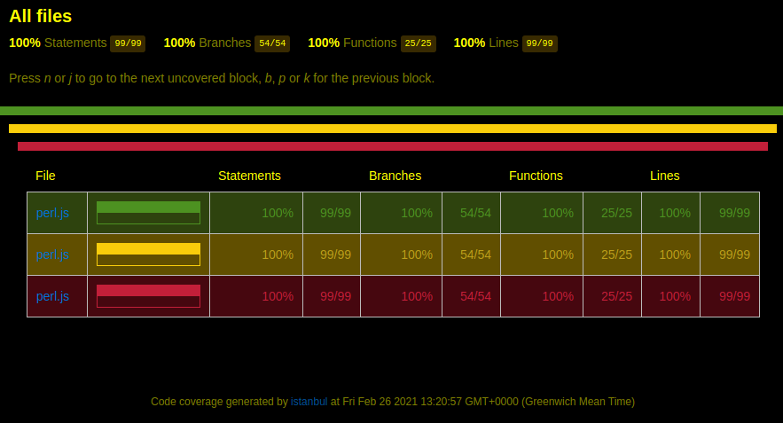
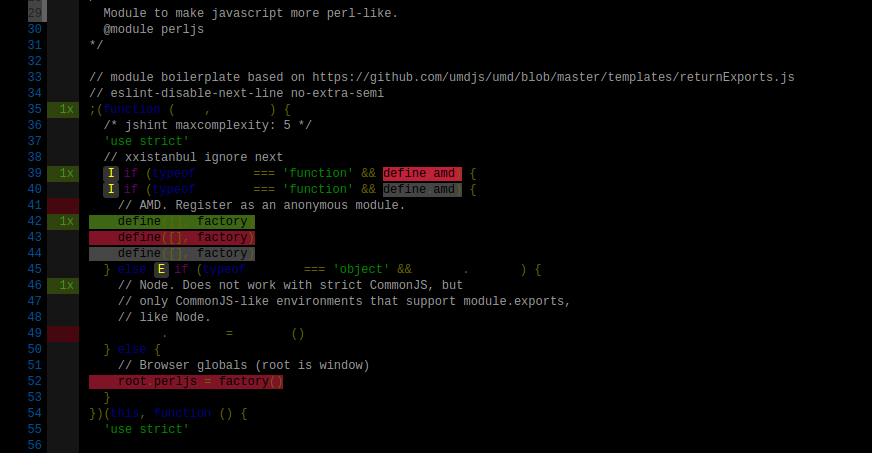
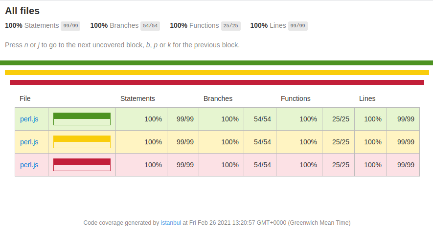
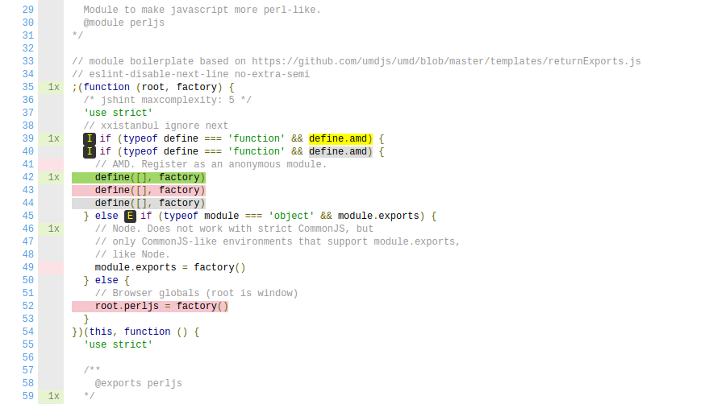

# nyc-dark

A dark color scheme CSS files for coverage tool [jest](https://www.npmjs.com/package/jest), [nyc](https://www.npmjs.com/package/nyc) / [istanbul-reports](https://www.npmjs.com/package/istanbul-reports), the full-featured javascript coverage tool.

## Motivation

To provide a dark color scheme for coverage tools with html output based on [istanbul-reports](https://www.npmjs.com/package/istanbul-reports).
For accessibility, for those who have visual difficulties or for those who just prefer a dark color theme when viewing their coverage results.

## Features

In this release (version: 3.0.3) we provide a replacement for `base.css` and `prettify.css` with a dark color scheme for use in istanbul browser based coverage reports.
* Contains only the dark scheme.

## Issues
* None known.  Please [report](https://github.com/bcowgill/nyc-dark/issues) any you discover.

## Usage

After installing *nyc-dark* you need to copy the CSS files to your coverage output directory to view the html output with a dark color scheme.

For example, if you have a *coverage* npm run script already configured you can add a *coverage:dark* script to view the HTML output in a dark theme.

Assuming your coverage tool outputs to `coverage/index.html` then you can configure your `package.json` as follows:

```javascript
// in package.json:
"scripts": {
  "coverage": "nyc mocha ... or jest ...",
  "coverage:dark": "npm run coverage",
  "postcoverage:dark": "cp ./node_modules/nyc-dark/*.css coverage/",
}
```

Then you run the dark coverage with:

```sh
npm run coverage:dark
```

And back to the light coverage with:

```sh
npm run coverage
```

If you have the coverage being generated every time a file changes you can have a separate shell script which copies the files every time the coverage updates:
```sh
./node_modules/nyc-dark/cp-cover.sh coverage/
```

Every time the coverage output is updated the CSS files will be copied to the output directory.

## Color Scheme Differences

### Nyc Dark Theme




### Nyc Default Theme




## Release History

* 3.0.2 release to match istanbul-reports stylesheets.
* 3.0.3 patch fix cp-cover.sh and improve dark scheme syntax highligh contrast.
